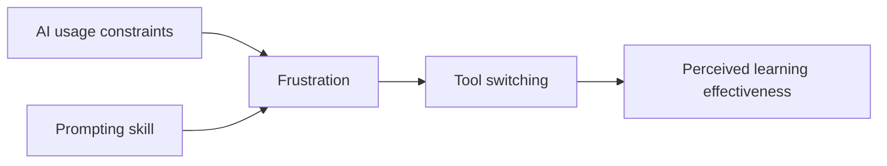

# AI Usage Constraints, Frustration, and Learning Effectiveness

### An exploratory PLS-SEM study among AIUB students

## Overview

This study examines whether AI service restrictions can interrupt university learning through a pathway from usage constraints to frustration, tool switching, and perceived learning effectiveness. It also studies prompting skill as a moderator and compares reported frustration between free and premium users.

## Study design

- Cross-sectional quantitative survey
- 320 usable AIUB student responses
- Partial least squares structural equation modeling
- 10,000 bootstrap samples
- Predictive assessment against a linear benchmark

## Main findings

- Greater constraints were associated with greater frustration.
- Frustration was positively associated with tool switching.
- Tool switching was negatively associated with perceived learning effectiveness.
- The sequential indirect association was **−0.424**, with a 95% bootstrap interval of **−0.472 to −0.375**.
- Free users reported greater frustration than premium users.
- Prompting skill lowered general frustration but strengthened the constraints-to-frustration relationship.

## Interpretation boundary

The model showed high in-sample explanatory power and positive predictive relevance, but it did not consistently outperform a linear benchmark. Several HTMT values exceeded accepted thresholds, and Harman's first factor explained 66.9% of item variance. The findings are therefore presented as exploratory associations—not causal effects or confirmatory evidence.

## Data availability and privacy

Raw participant responses are not included. Public release requires confirmation of participant consent, institutional requirements, de-identification, and removal of indirect identifiers. A data dictionary or synthetic example dataset can be released later without exposing respondents.

See [docs/STUDY_DESIGN.md](docs/STUDY_DESIGN.md) for the reporting checklist.

## Contact

**Protik Biswas** · [GitHub](https://github.com/pkhunter47) · [LinkedIn](https://www.linkedin.com/in/protik-biswas-83001827b/) · [Email](mailto:protikbiswas3099@gmail.com)
